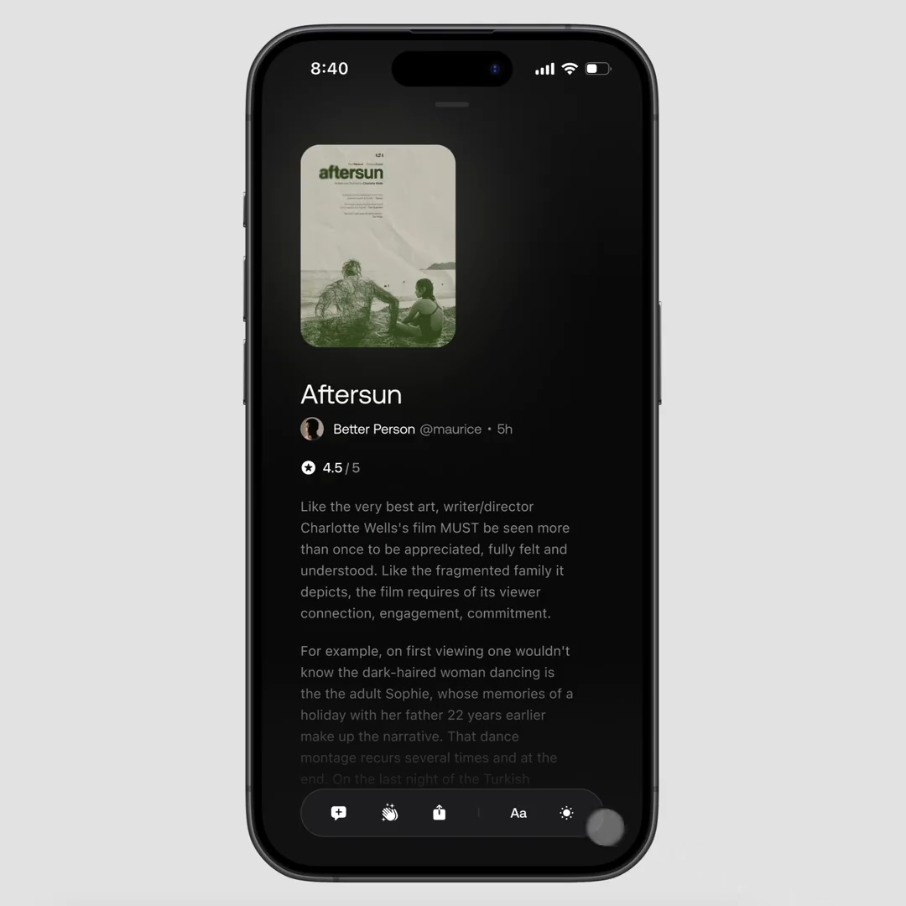
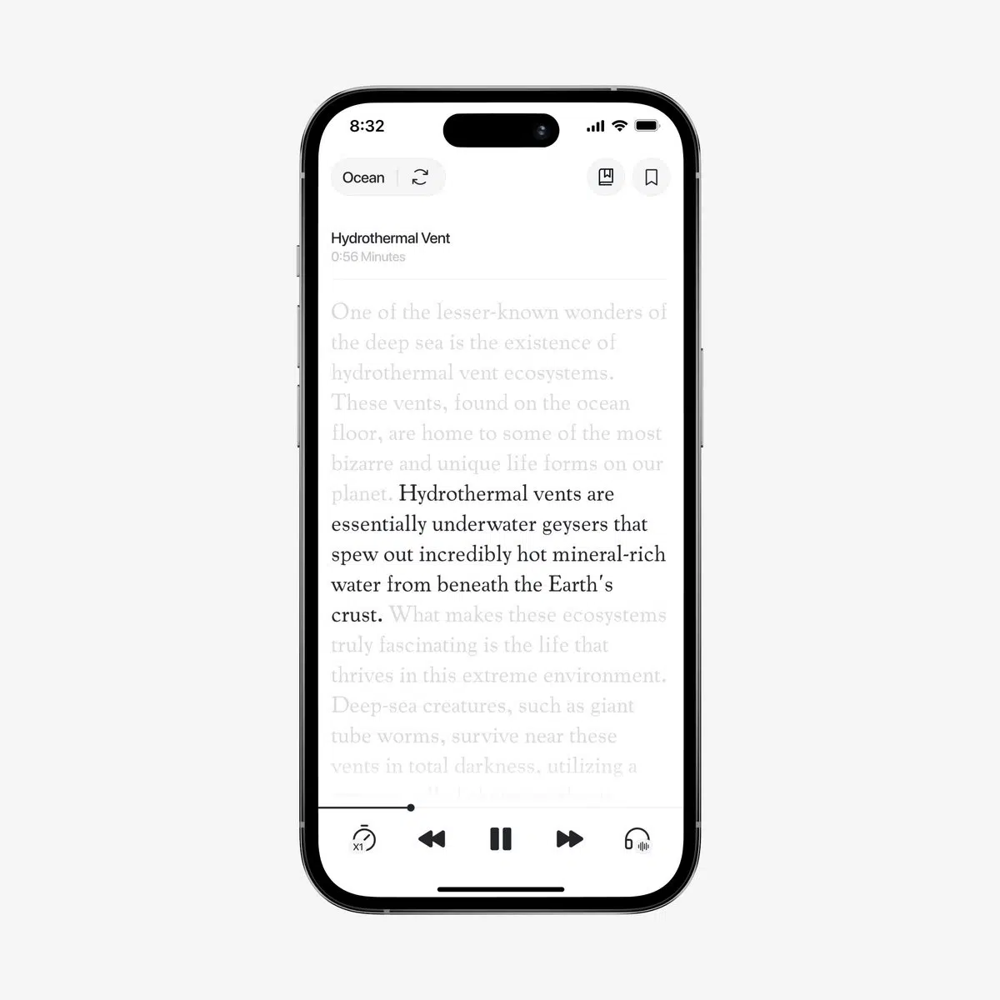
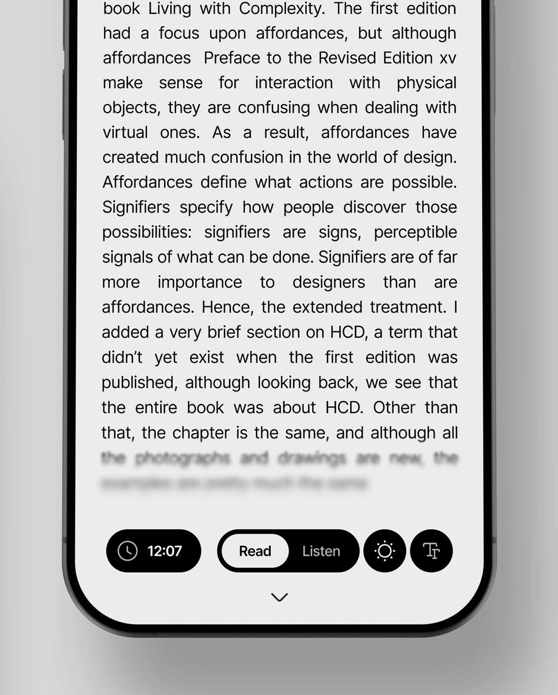
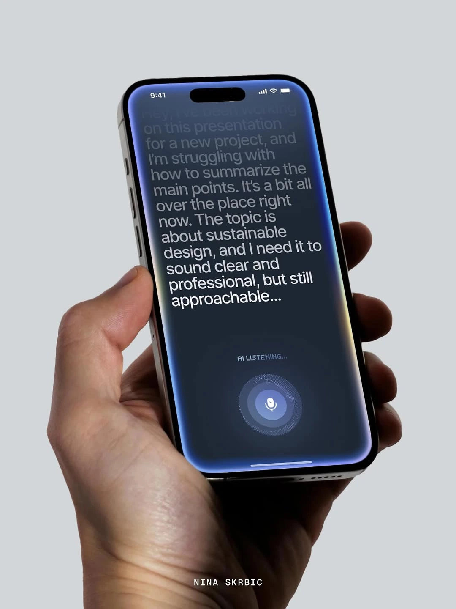
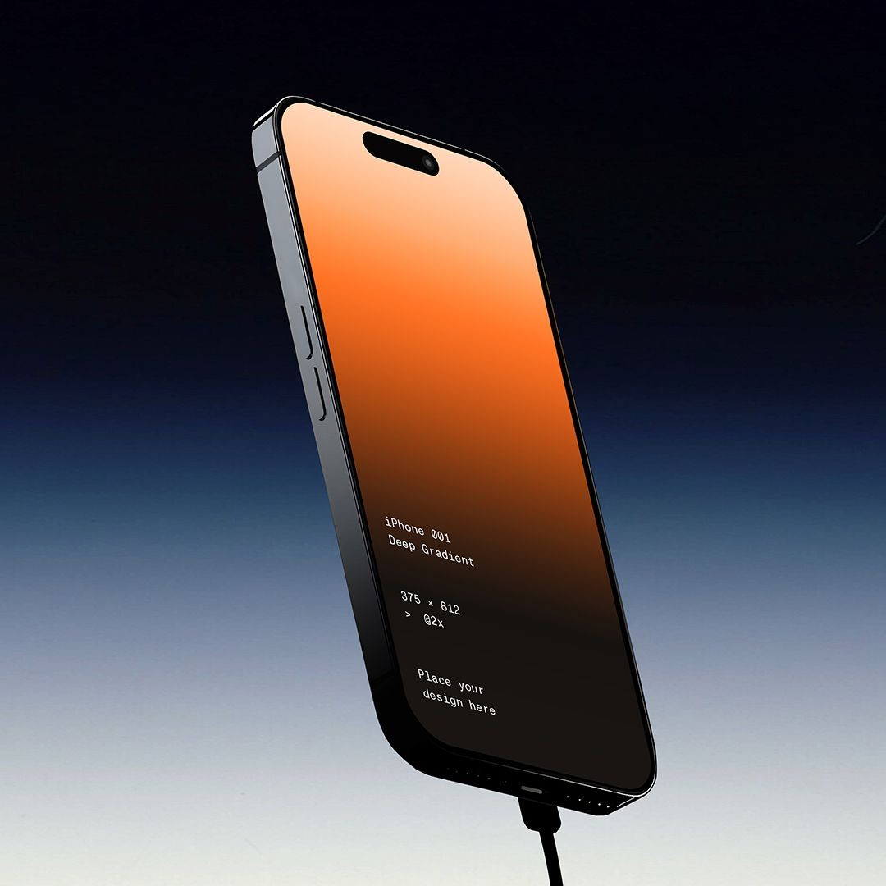
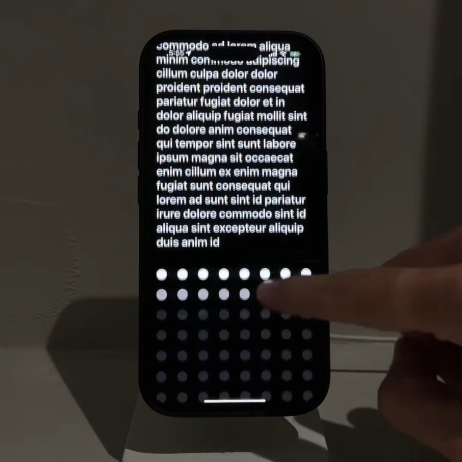
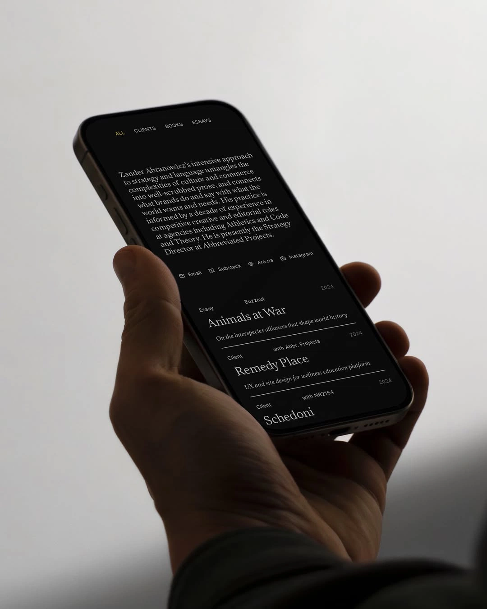
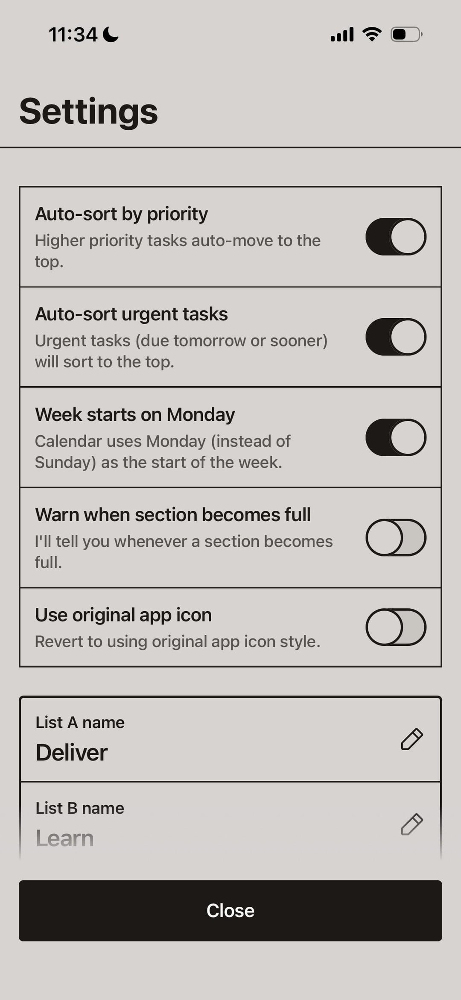
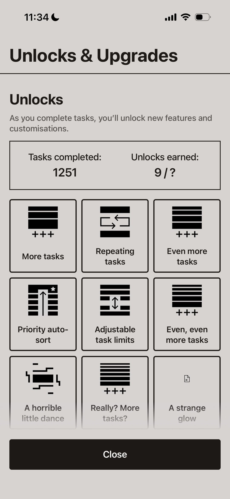
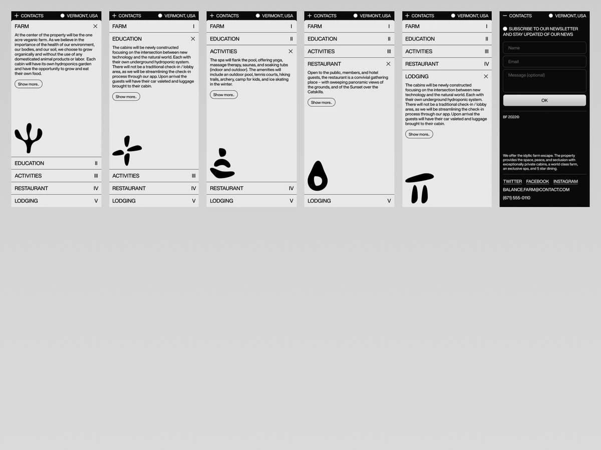

# Original reference images

All ten images supplied by David are preserved here, byte-for-byte, in their
original order. They are visual references, not implemented dashboard screens.
The [reference review](../portfolio/reference-review.md) describes what to adopt
and what to omit. Third-party artwork remains attributed to its original creators;
including these examples does not grant a reuse license. Original source URLs
were not supplied; visible credits have been retained.

## 01 — Dark film reader

## 02 — Synchronized listening text

## 03 — Reading and typography controls

## 04 — Live voice dictation

## 05 — Terminal phone study

## 06 — Text and dot interaction

## 07 — Editorial portfolio

## 08 — Square settings rows

## 09 — Task symbols and upgrades

## 10 — Mobile accordion sequence

