# Stitch screenshot archive

Exported from the existing “WEIGEND HUB — Terminal Workspace” project in
Google Stitch on 15 September 2026. All 15 application screens are included,
including superseded variants. None is a claim of implemented functionality.

The [reviewed design.md](../../design.md) was prepared from Stitch’s
`design.md — WEIGEND / HUB (Updated)` document after two specification rounds.
The local editorial pass restored missing details from the repository, removed
checked acceptance claims and clarified save semantics. The older document and
the automatic theme sheet are superseded; they do not define the implementation.

## Export verification

Twelve PNGs are unchanged images from Stitch’s download archive. Three archive
entries contained only `<FIFE Image failed to fetch>` despite their `.png` names.
Those three were replaced with full-page Chrome JPEG captures of the corresponding
unchanged exported HTML at a 390 × 844 CSS-pixel viewport. Their source HTML
checksums and capture method are recorded in the
[image inventory](../image-inventory.json). Remote prototype font/CDN behavior
can influence these captures. The complete original archive stays local.

The reference HTML uses prototype fonts, iconfonts, inline styles and utilities.
It is not copied into the app. Follow the repository tokens, SVG icons and
central stylesheet instead. Old headers, bottom navigation and clipping are
preserved as historical evidence, not approved patterns.

## Today, early desktop

Rejected: dense chrome and metric sections.
Original Stitch PNG.

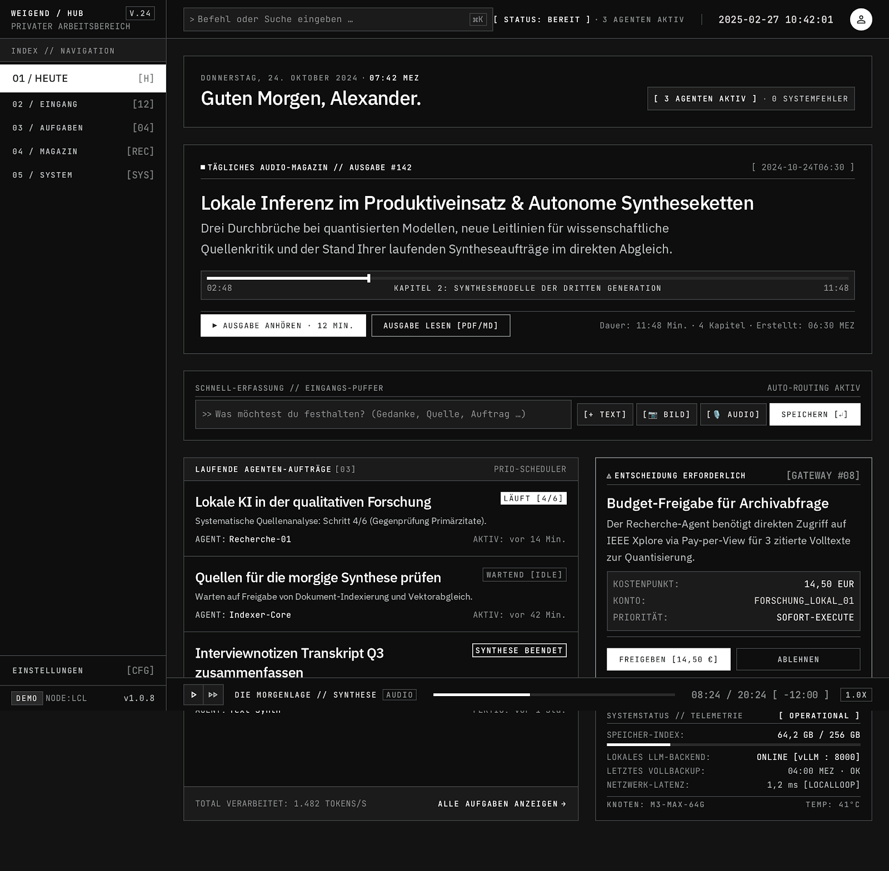

## Inbox, early desktop

Rejected: dense split pane and technical labels.
Original Stitch PNG.

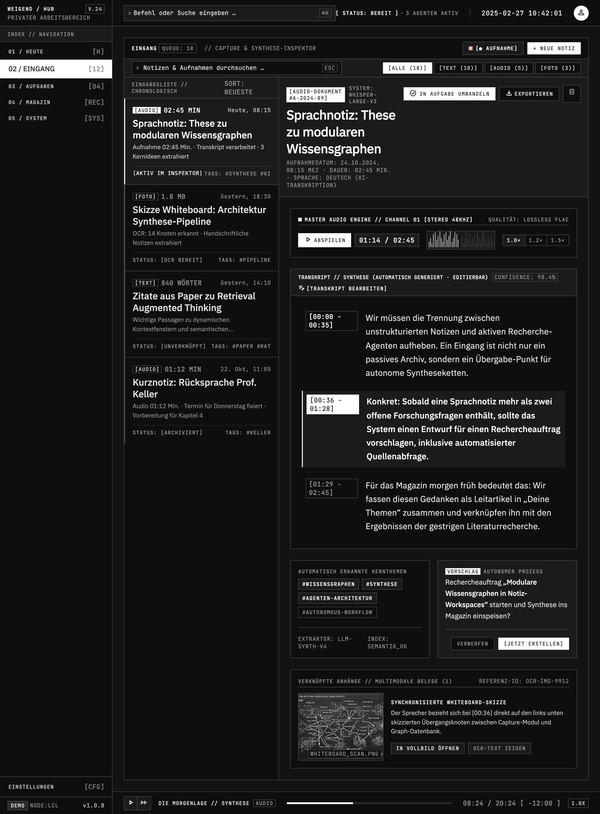

## Tasks, early desktop

Rejected: table and metric grid.
Original Stitch PNG.

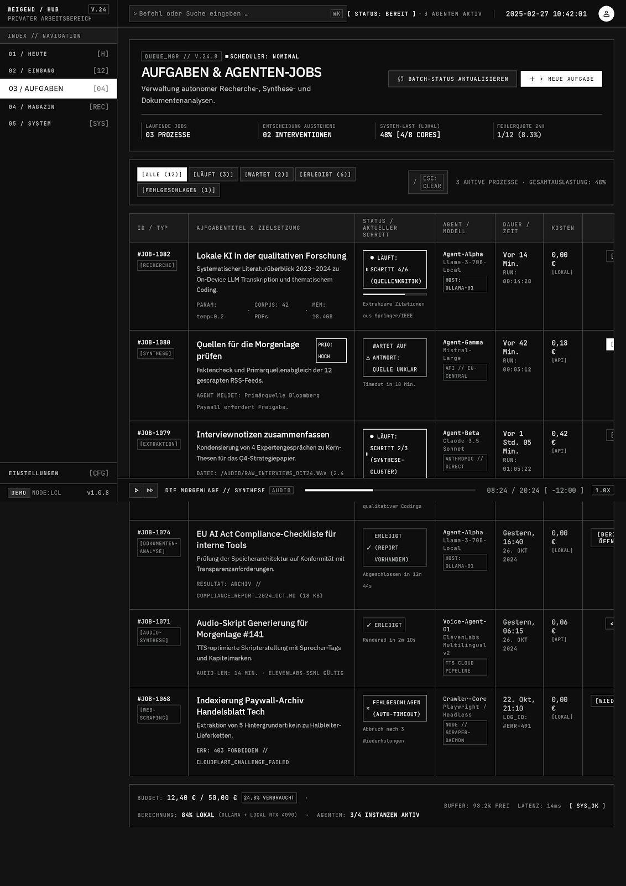

## Today, intermediate mobile

Rejected: branding, gear, page title and large gaps.
Chrome capture of exported HTML.

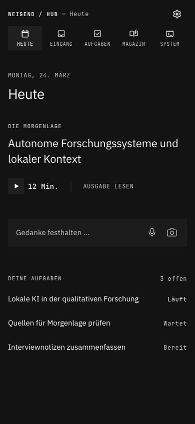

## Inbox, intermediate mobile

Historical: duplicated headings and excessive metadata.
Original Stitch PNG.

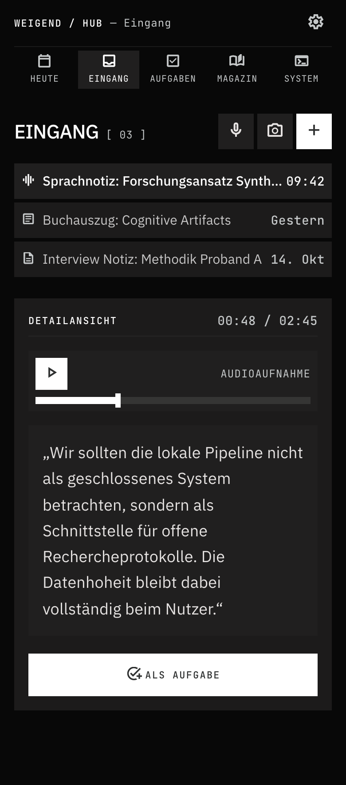

## Tasks, reduced mobile

Exploration only: navigation overlaps the filter row in the exported HTML.
Chrome capture of exported HTML.

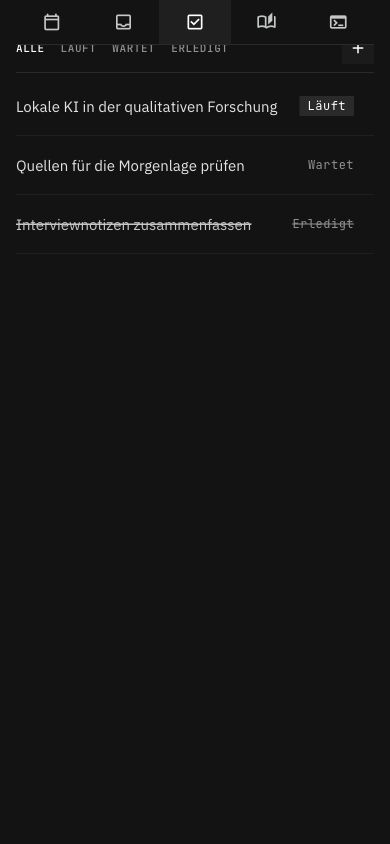

## Today, reduced mobile

Content-first direction; exact colors, typography and spacing follow the repository tokens.
Chrome capture of exported HTML.

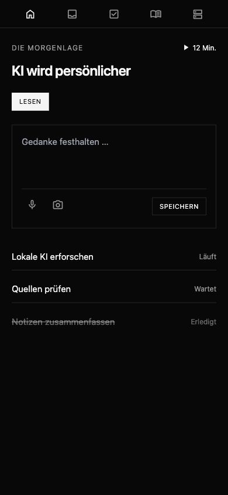

## Article

Reading direction; verify toolbar size and wrapping in implementation.
Original Stitch PNG.

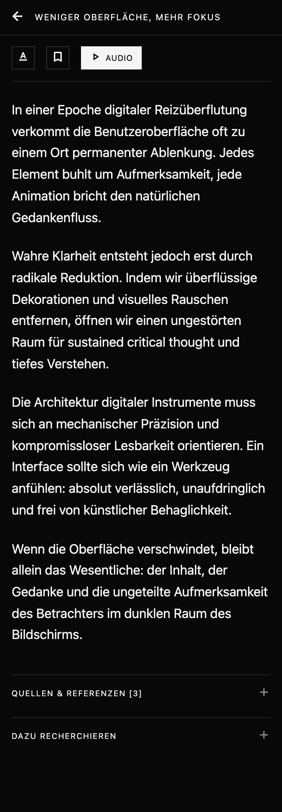

## Magazine

Short editorial list; navigation placement in the example is not authoritative.
Original Stitch PNG.

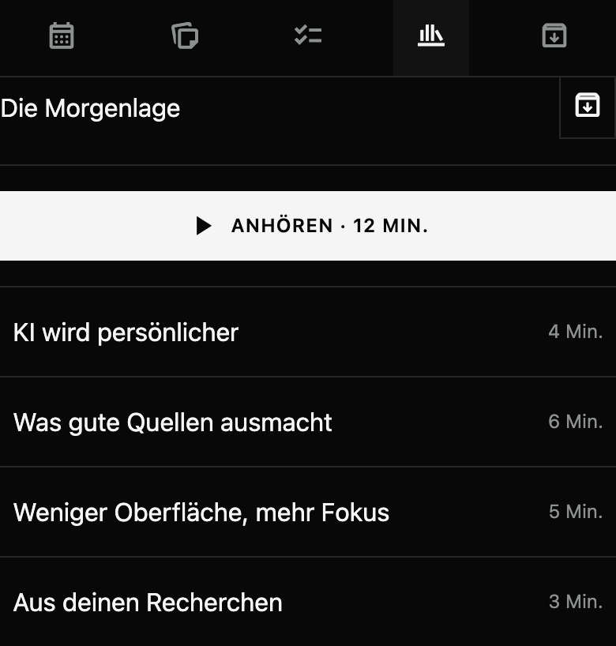

## Inbox, reduced mobile

Immediate capture and short rows; apply the top-navigation contract.
Original Stitch PNG.

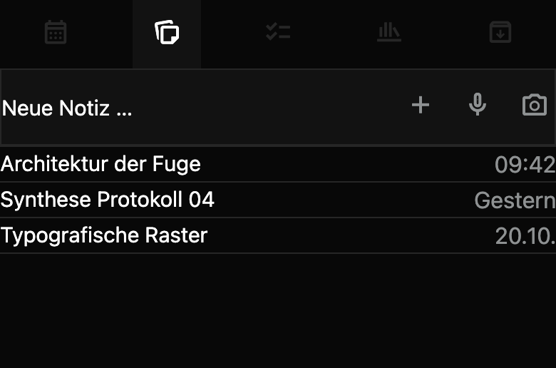

## Operations

Concise observations; demo values are not actual server measurements.
Original Stitch PNG.

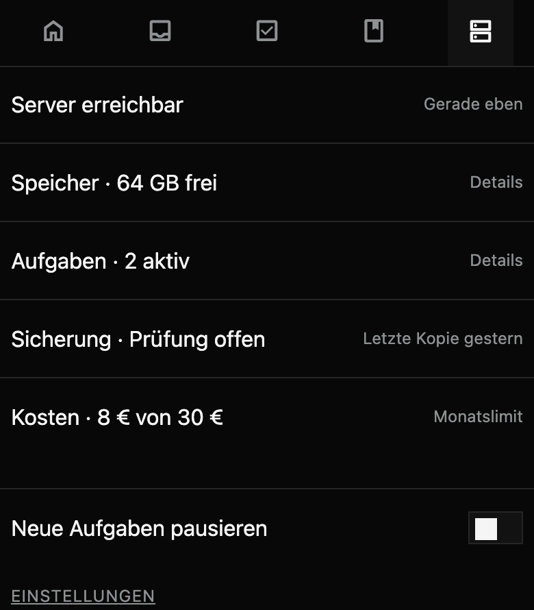

## Task detail

Progress, inline question and result disclosure.
Original Stitch PNG.

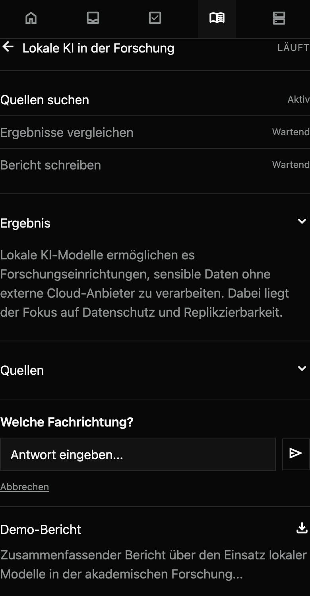

## Create task

Question first, deadline and budget disclosed when needed.
Original Stitch PNG.

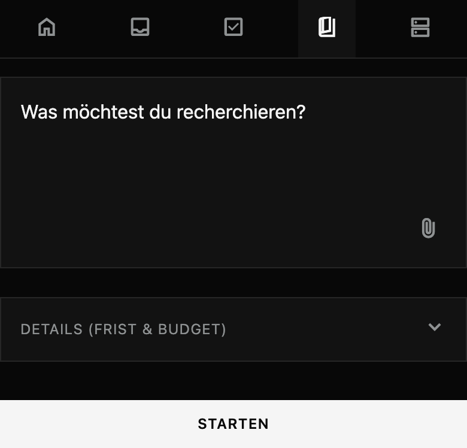

## Preferences

Compact settings; enter through Operations.
Original Stitch PNG.

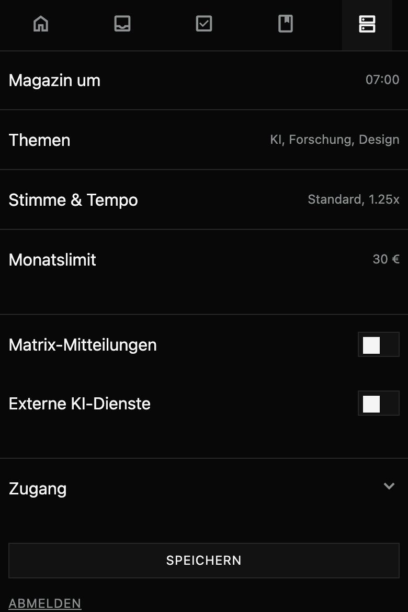

## Sign in

Form example only; authentication and recovery are not implemented.
Original Stitch PNG.

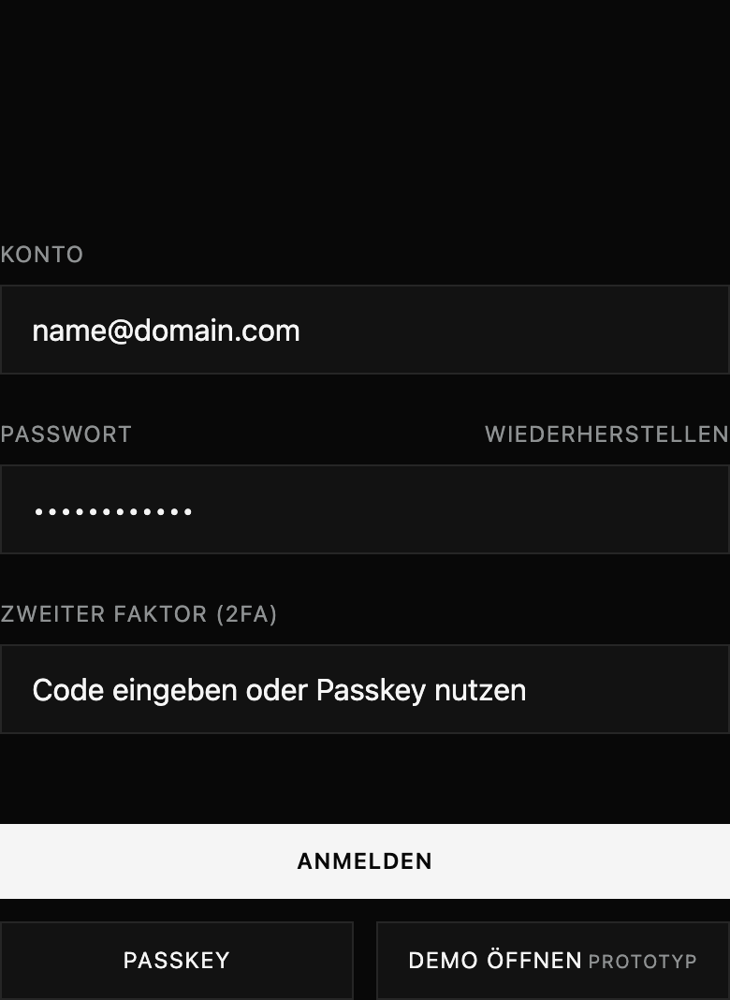
