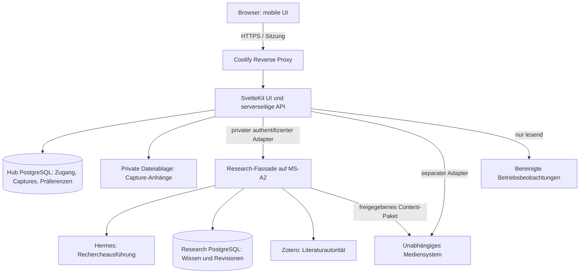

# Zielarchitektur und Verantwortlichkeiten

Status: Zielbild, keine bereitgestellten Dienste. Hub ist ein eigenständiges
Projekt und ein Client der bestehenden Forschungsarchitektur.

Die Web-App läuft künftig auf Hetzner, Research auf dem MS-A2. Der
[Hybrid-Backend-Entwurf](hybrid-backend.md) konkretisiert private HTTPS-Verbindung,
Containergrenzen, dauerhafte Zustellung und Verfügbarkeit bei Heimserverausfall.
Der [Deployment-Audit](deployment-audit.md) trennt Livebefunde von diesem Zielbild.
Der [Wissensabgleich](knowledge-integration.md) definiert den zuerst aufzubauenden
lokalen MVP und dessen spätere Anbindung ohne Abhängigkeit von Recherchejobs.



## Minimaler eigener Stack

Ein SvelteKit-Projekt enthält UI und serverseitige API als Backend-for-Frontend.
Svelte 5, TypeScript und Bun für Entwicklung/Checks. `adapter-node` liefert den
Node-Server für den Coolify-Container. Keine zweite FastAPI-Schicht allein für
die Weboberfläche. Falls die Research-Fassade neu entsteht, gehört sie ins
Forschungssystem und folgt dessen Python-/FastAPI-Konventionen.

Ein eigenes PostgreSQL-Schema bzw. eine eigene Datenbank mit separatem Nutzer
hält Zugang, noch nicht übernommene Captures, Präferenzen und Zuordnungen. Es ist
keine neue Wissensautorität. Für Dateien zunächst eine private Volume-Ablage
hinter einer kleinen Storage-Schnittstelle; S3 erst bei konkretem Betriebsbedarf.

## Eigentum an Daten und Verhalten

| Bereich | Autorität | Rolle von Hub |
| --- | --- | --- |
| Zugang/Sitzungen | Hub/Auth-Bibliothek | Konto und Session schützen |
| Unverarbeiteter Eingang | Hub | aufnehmen, dauerhaft speichern, übertragen |
| Wissen/Quellen/Review | Research und Zotero | revisionsgebunden lesen und Befehle vermitteln |
| Rechercheplanung/-ausführung | Hermes innerhalb Research | Auftrag über verifizierten Adapter übergeben |
| Forschungsauftragsstatus | Research-Auftragsregister mit Hermes-Zuordnung | lesen und kurzzeitig projizieren |
| Magazintext/-freigabe | Research Publication/Review | Ausgabe darstellen, Freigabebefehl vermitteln |
| Audio/Renderjobs | eigenständiges Mediensystem | vorhandenes Audio lesen, expliziten Auftrag vermitteln |
| Gerätepräferenzen/Leseposition | Hub | speichern, synchronisieren |
| Serverzustand/Backup | jeweiliger Betriebsdienst | bereinigte Beobachtungen anzeigen |

Keine Direktzugriffe aus dem Browser auf Research, Hermes, Datenbanken, Coolify,
NAS oder Provider-Keys. Serveradapter konstruieren Identität und Scope selbst;
Clientfelder dürfen keine Berechtigungen erteilen.

## Ausführung und Zuverlässigkeit

Hub führt keinen Modellloop aus. Lange Arbeit endet nicht an einem HTTP-Timeout.
Research muss Annahme und Ausführungs-ID dauerhaft bestätigen und die Verbindung
zur nativen Hermes-Ausführung halten. Falls die installierte Hermes-Version das
nicht zuverlässig anbietet, ist zunächst der Adapter zu ergänzen; die UI darf
dann nur den expliziten Mockbetrieb verwenden.

Capture-Speicherung und spätere Research-Übernahme sind getrennte Schritte.
Eine kleine transaktionale Outbox in Hub ist ausschließlich Zustellmechanik,
kein Forschungs-Scheduler und keine zweite Agentensteuerung. Ein eigener
Delivery-Prozess aus demselben Image verarbeitet sie unabhängig von Webrequests
und aktualisiert berechtigte Lesekopien. Neue Aufträge werden bei
nicht erreichbarem Research nicht heimlich auf spätere Ausführung gesetzt.
Unklare Annahmen werden über Request-ID und Idempotenz abgeglichen.

Freigegebene Artikel-/Audiorevisionen dürfen als private, unveränderliche
Auslieferungskopien auf Hetzner liegen. Eigentum, Frist und Widerruf bleiben
im [Verfügbarkeitsvertrag](hybrid-backend.md) definiert. Die Kopie ist keine
zweite Wissensautorität und kein umfassender Datenbankspiegel.

Zu Beginn pollt die UI sichtbare aktive Jobs alle fünf Sekunden, inaktiven
Status höchstens alle 30 Sekunden. Versteckte Tabs stoppen; nach Wiederaufnahme
sofort abgleichen. Bei Fehlern exponentiell bis 60 Sekunden warten und
Veraltetheit anzeigen. SSE ist ein späterer Transport, kein eigener Jobzustand.

## Zukünftige Codegrenzen

```text
src/routes/                    UI-Routen und dünne HTTP-Handler
src/lib/components/            wiederverwendbare UI
src/lib/domain/                Hub-Regeln und erlaubte Zustandsübergänge
src/lib/server/application/    Anwendungsfälle und Transaktionsgrenzen
src/lib/server/adapters/       Research, Media, Storage, Auth, Operations
src/lib/server/persistence/    Hub-Tabellen und Migrationen
src/app.css                    gesamtes App-Styling
```

Diese Verzeichnisse werden erst bei der Implementierung angelegt. Keine
generischen Manager, Pluginplattform oder Service pro UI-Komponente.

## Entwicklungs- und Produktionsmodus

Lokale Entwicklung beginnt mit synthetischen Fixtures an denselben Verträgen.
Mockmodus ist deutlich erkennbar und technisch von produktiven Zugangsdaten
getrennt. Produktiv darf ein ausgefallener Adapter niemals auf erfundene
Erfolgsdaten zurückfallen. Geheimnisse sind ausschließlich serverseitig.
