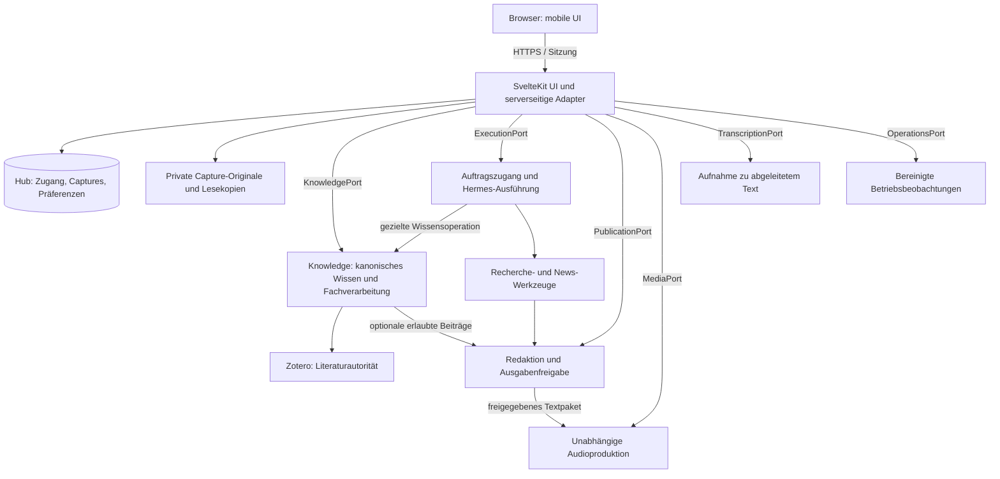

# Zielarchitektur und Verantwortlichkeiten

Status: Zielbild, keine bereitgestellten Dienste. Hub ist ein eigenständiges
Projekt und ein Client mehrerer spezialisierter Systeme. Die
[Modulgrenzen](system-modules.md) ersetzen den früheren Sammelbegriff Research
für Wissen, allgemeine Ausführung und Publikation.

Die Web-App läuft künftig auf Hetzner, Knowledge und allgemeine Ausführung
auf dem MS-A2. Der
[Hybrid-Backend-Entwurf](hybrid-backend.md) konkretisiert private HTTPS-Verbindung,
Containergrenzen, dauerhafte Zustellung und Verfügbarkeit bei Heimserverausfall.
Der [Deployment-Audit](deployment-audit.md) trennt Livebefunde von diesem Zielbild.
Der [Wissensabgleich](knowledge-integration.md) definiert die Anbindung ohne
Abhängigkeit von Recherchejobs. Der [aktuelle Codeabgleich](knowledge-server-status.md)
trennt vorhandene lokale Funktionen von noch fehlenden Remote-Verträgen.



## Minimaler eigener Stack

Ein SvelteKit-Projekt enthält UI und serverseitige API als Backend-for-Frontend.
Svelte 5, TypeScript und Bun für Entwicklung/Checks. `adapter-node` liefert den
Node-Server für den Coolify-Container. Keine zweite FastAPI-Schicht allein für
die Weboberfläche. Nur der Knowledge-HTTP-Adapter gehört in das Knowledge-Projekt.
Allgemeiner Auftragszugang und Publikation erhalten eigene fachliche Grenzen;
konkrete Repository-/Prozessaufteilung wird erst bei Umsetzung festgelegt.

Ein eigenes PostgreSQL-Schema bzw. eine eigene Datenbank mit separatem Nutzer
hält Zugang, persönliche Captures, Transferbelege, Präferenzen und Zuordnungen. Es ist
keine neue Wissensautorität. Für Dateien zunächst eine private Volume-Ablage
hinter einer kleinen Storage-Schnittstelle; S3 erst bei konkretem Betriebsbedarf.

## Eigentum an Daten und Verhalten

| Bereich | Autorität | Rolle von Hub |
| --- | --- | --- |
| Zugang/Sitzungen | Hub/Auth-Bibliothek | Konto und Session schützen |
| Unverarbeiteter Eingang | Hub | aufnehmen, dauerhaft speichern, übertragen |
| Wissen/Quellen/Review | Knowledge und Zotero | revisionsgebunden lesen und Befehle vermitteln |
| Rechercheplanung/-ausführung | Execution mit Hermes | Auftrag über verifizierten Adapter übergeben |
| Forschungsauftragsstatus | Execution-Auftragsregister mit Hermes-Zuordnung | lesen und kurzzeitig projizieren |
| Magazintext/-freigabe | Publication/Redaktion | Ausgabe darstellen, Freigabebefehl vermitteln |
| Transkription | Transcription-Worker; Original im Hub | Auftrag und abgeleiteten Text vermitteln |
| Audio/Renderjobs | eigenständiges Mediensystem | vorhandenes Audio lesen, expliziten Auftrag vermitteln |
| Gerätepräferenzen/Leseposition | Hub | speichern, synchronisieren |
| Serverzustand/Backup | jeweiliger Betriebsdienst | bereinigte Beobachtungen anzeigen |

Keine Direktzugriffe aus dem Browser auf private Fachadapter, Hermes, Datenbanken, Coolify,
NAS oder Provider-Keys. Serveradapter konstruieren Identität und Scope selbst;
Clientfelder dürfen keine Berechtigungen erteilen.

## Ausführung und Zuverlässigkeit

Hub führt keinen Modellloop aus. Lange Arbeit endet nicht an einem HTTP-Timeout.
Execution muss Annahme und Ausführungs-ID dauerhaft bestätigen und die Verbindung
zur nativen Hermes-Ausführung halten. Falls die installierte Hermes-Version das
nicht zuverlässig anbietet, ist zunächst der Adapter zu ergänzen; die betroffenen Execution-Funktionen bleiben bis dahin ausdrücklich im
Mockbetrieb. Capture und andere bereits verifizierte Fähigkeiten bleiben
unabhängig nutzbar.

Captures bleiben im Hub. Eine gezielte spätere Knowledge-Übernahme ist optional
und benötigt einen unterstützten Fachbefehl; freie Gedanken brauchen kein Wissen.
Eine kleine transaktionale Outbox in Hub ist ausschließlich Zustellmechanik,
kein Forschungs-Scheduler und keine zweite Agentensteuerung. Ein eigener
Delivery-Prozess aus demselben Image verarbeitet sie unabhängig von Webrequests
und aktualisiert berechtigte Lesekopien. Neue Aufträge werden bei
nicht erreichbarer Execution nicht heimlich auf spätere Ausführung gesetzt.
Unklare Annahmen werden über Request-ID und Idempotenz abgeglichen.

Freigegebene Artikel-/Audiorevisionen dürfen als private, unveränderliche
Auslieferungskopien auf Hetzner liegen. Eigentum, Frist und Widerruf bleiben
im [Verfügbarkeitsvertrag](hybrid-backend.md) definiert. Die Kopie ist keine
zweite Wissensautorität und kein umfassender Datenbankspiegel.

Zu Beginn pollt die UI sichtbare aktive Jobs alle fünf Sekunden, inaktiven
Status höchstens alle 30 Sekunden. Versteckte Tabs stoppen; nach Wiederaufnahme
sofort abgleichen. Bei Fehlern exponentiell bis 60 Sekunden warten und
Veraltetheit anzeigen. SSE ist ein späterer Transport, kein eigener Jobzustand.

## Zukünftige Codegrenzen

```text
src/routes/                    UI-Routen und dünne HTTP-Handler
src/lib/components/            wiederverwendbare UI
src/lib/domain/                Hub-Regeln und erlaubte Zustandsübergänge
src/lib/server/application/    Anwendungsfälle und Transaktionsgrenzen
src/lib/server/adapters/       Knowledge, Execution, Publication, Transcription, Media, Storage, Auth, Operations
src/lib/server/persistence/    Hub-Tabellen und Migrationen
src/app.css                    gesamtes App-Styling
```

Diese Verzeichnisse werden erst bei der Implementierung angelegt. Keine
generischen Manager, Pluginplattform oder Service pro UI-Komponente.

## Entwicklungs- und Produktionsmodus

Lokale Entwicklung beginnt mit synthetischen Fixtures an denselben Verträgen.
Mockmodus ist deutlich erkennbar und technisch von produktiven Zugangsdaten
getrennt. Produktiv darf ein ausgefallener Adapter niemals auf erfundene
Erfolgsdaten zurückfallen. Geheimnisse sind ausschließlich serverseitig.
