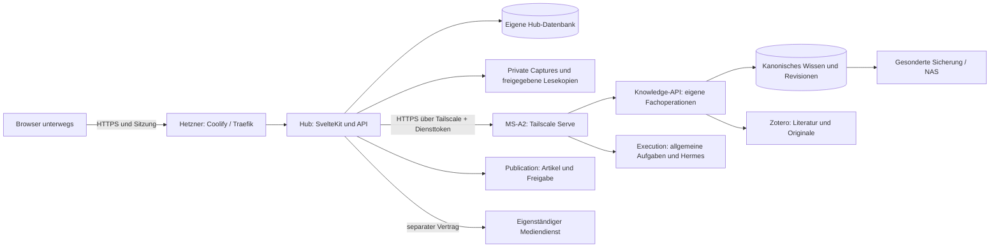

# Backend zwischen Hetzner und Heimserver

Aktualisiert: 15. September 2026. Architekturvorschlag auf Basis der Server-Tasks,
Repository-Dokumentation und einer read-only SSH-/Coolify-Inspektion.
Die Web-App gehört nach der aktuellen Nutzervorgabe auf Hetzner; Knowledge und
allgemeine Ausführung bleiben fachlich getrennte Bereiche auf dem MS-A2.
Die [Modulgrenzen](system-modules.md) präzisieren die ursprüngliche Research-Sammelfassade. Die hier beschriebene Verbindung ist noch nicht eingerichtet.

## Aufteilung

Hetzner hält Anmeldung, Sitzungen, schnelle Eingänge, Uploads, Lesepositionen und
Zustellbelege. Dadurch lassen sich auch bei ausgeschaltetem Heimserver Gedanken
speichern. Es gibt eine eigene Hub-Datenbank; weder Coolifys interne Datenbank
noch die Matrix-Datenbank wird dafür verwendet.

Knowledge hält Wissen, Revisionen, Evidenz und Wissensreview; Zotero besitzt
Literatur und Original-PDFs. Knowledge-spezifische Verarbeitung und deren lokale
Jobs bleiben in der bestehenden Python-Anwendung. Ihr HTTP-Adapter erweitert
nur diese Fachoperationen, nicht das gesamte persönliche Serversystem.

Allgemeine Aufträge, Hermes-Zuordnung, Rückfragen und Stop gehören zu Execution.
Redaktion und Ausgabenfreigabe gehören zu Publication. Die beiden Fähigkeiten
müssen Knowledge nur verwenden, wenn der konkrete Ablauf dessen Wissen benötigt.
Ein gemeinsamer privater HTTPS-Einstieg kann nach Fähigkeit routen, ohne dass
Knowledge alle Aufträge entgegennimmt. Der Matrix-Gateway bleibt ein anderer
Client; eine Chatantwort ersetzt keinen belastbaren Annahmebeleg.

Der [Wissensabgleich](knowledge-integration.md) gilt ausschließlich für dessen
Fachzugriff. Private Netzwerkprüfung und API-Verträge sind erforderlich, bevor
Live-Funktionen aktiviert werden; lokale Fixtures können vorher entstehen.

Media bleibt ein eigenes System mit eigenen Jobs, Daten und Geheimnissen.
Ein Betrieb auf dem MS-A2 ist möglich, seine endgültige Hostzuordnung bleibt
offen. Alle lokalen Verfahren müssen unter Linux ohne GPU funktionieren.

## Verbindung und Isolation

Arbeitsentscheidung: Tailscale auf dem Hetzner-Host ergänzen, den vorhandenen
MS-A2-Knoten weiterverwenden. Keine Portfreigabe am Heimrouter, kein Exit-Node,
kein Subnet-Routing ins Heimnetz und kein öffentliches Research-Backend.
Ein zusätzlicher Coolify-Servereintrag für den MS-A2 ist dafür nicht nötig.

Auf dem MS-A2 binden die privaten Fachadapter zunächst nur an Loopback. Tailscale Serve übernimmt
privates HTTPS auf TCP 443. Eigene Diensttokens begrenzen die erlaubten
Operationen zusätzlich. HTTPS-Freigabe, Zertifikat und bestehende Serve-Belegung
vorher prüfen. Serve ist für Tailnet-Zugriff dokumentiert; Funnel gehört nicht
zu diesem Entwurf. [Tailscale Serve](https://tailscale.com/docs/features/tailscale-serve).

Der Browser spricht ausschließlich mit Hub. Hub verwendet einen fest
konfigurierten privaten Hostnamen; Nutzerinhalte dürfen Zieladresse, Header,
Scope oder Downloadziel nicht frei setzen. Keine Shell über SSH pro Auftrag,
keine freien Hermes-Toolaufrufe und keine SQL-Verbindung von Hetzner nach Hause.

Das Zugriffsmodell erlaubt dem Hetzner-Dienst nur TCP 443 zum MS-A2. Bei einer
späteren lokalen Media-API kommt ein ausdrücklich vereinbarter eigener Port
und Token hinzu. SSH, RDP, SMB, PostgreSQL, NAS und andere Tailnet-Geräte bleiben
für diesen Dienst gesperrt. Davids administrative Geräte behalten separat
ihre geprüften Zugänge.

Die gesamte bestehende Tailnet-Policy muss vor Enrollment geprüft werden:
Eine engere Grant-Regel hebt ein vorhandenes breites Allow nicht auf. Tags und
Tag-Eigentümer sind kontrolliert zu vergeben; eine Umstellung des MS-A2 auf
Tags darf bestehende persönliche Adminrechte nicht unbeabsichtigt entfernen.
[Grant-Semantik](https://tailscale.com/docs/reference/syntax/grants).

### Der Containerpfad ist ein eigener Abnahmepunkt

Hub bleibt im Docker-Bridge-Netz. Ausgehende Verbindungen müssen vom tatsächlichen
Hub-Container über den Host nach Tailscale funktionieren, einschließlich DNS,
TLS-Prüfung, Routing und wirksamer Quellidentität. Ein erfolgreicher Host-Ping
beweist das nicht. Docker behandelt Container-DNS und Netzräume ausdrücklich
separat. [Docker Networking](https://docs.docker.com/engine/network/).

Für den ersten Pilot kann ein konfiguriertes `extra_hosts`-Mapping den privaten
vollständigen Hostnamen auf die bestätigte Tailnet-IP abbilden. Die HTTPS-URL
bleibt der Zertifikatsname. Kein globaler DNS-Umbau und kein Abschalten der
Zertifikatsprüfung als Fehlerbehebung. Mapping bei Wiederaufnahme eines Knotens
prüfen; echte Werte gehören nur in die Deployment-Konfiguration.

Bei Host-Tailscale teilen erlaubte Container die Netzwerkidentität des Hosts.
Die Policy allein isoliert Hub daher nicht von anderen Hetzner-Workloads.
Eine persistente Host-Egress-Regel muss die Hub-Web-/Worker-Netzpfade erlauben und andere
Containerpfade zur jeweiligen Fach-API sperren; auch nach Redeploy testen. Tokens sind
nur in den jeweils berechtigten Hub-Prozessen verfügbar. Root/Coolify bleibt Teil der Vertrauensbasis.
Wenn diese Trennung im Coolify-Pilot nicht stabil gelingt, bekommt Hub einen
eigenen Tailscale-Sidecar mit Dienstidentität. Das ist eine gezielte Alternative,
keine zusätzliche Pflichtkomponente im ersten Entwurf.

Hub erhält keinen Docker-Socket und keine Coolify-Administrator-Credentials.
App und eigene DB teilen ein privates Backend-Netz; nur der Webdienst ist am
Proxy-Netz angeschlossen. Die DB veröffentlicht keinen Host-Port. Die tatsächliche
Coolify-Netzanbindung muss geprüft werden, bevor Isolation behauptet wird.

## Dauerhafte Übergabe

### Gedanke erfassen

1. Hub prüft und speichert Text beziehungsweise Dateien auf Hetzner dauerhaft.
2. Der Capture darf dauerhaft im Hub bleiben. Nur eine ausdrückliche, vom
   Knowledge-Vertrag unterstützte Wissensaktion legt Revision und Zustellauftrag
   in derselben Hub-Transaktion fest.
3. Ein kleiner Delivery-Worker übermittelt genau diese Revision und deren
   erforderliche Quellen-/Wissensreferenzen. Freie Gedanken werden nicht
   über eine erfundene Referenz in das aktuelle Notizmodell gezwungen.
4. Knowledge registriert die unterstützte Fachoperation und Referenzen atomar.
5. Erst der bestätigte Beleg setzt diesen Transfer auf `transferred`.

Der Worker ist ein eigener Prozess aus demselben Hub-Image, damit er unabhängig
von offenen Browserseiten und HTTP-Laufzeiten arbeitet. Er liest nur die
transaktionale Outbox; kein Redis und kein zweiter Forschungs-Scheduler.
Leases und begrenzte Wiederholungen verhindern parallele Doppelzustellung;
nach ausgeschöpften Versuchen bleibt ein sichtbarer Transferfehler.

Anhänge bleiben im ersten Knowledge-Pilot im Hub; eine vollständige Übernahme
mit still weggelassenen Dateien ist unzulässig. Andere ausdrücklich unterstützte
Transfers, etwa an Transcription, verwenden begrenzte authentifizierte Uploads
mit Hash/Größe statt öffentlicher Links. Jede Antwort bestätigt nur ihren eigenen
Verarbeitungsschritt, keine implizite Wissensaufnahme.

### Recherche auslösen

Hub schreibt zuerst einen RequestReceipt mit stabiler Request-ID. Execution
bestätigt erst nach dauerhaftem Eintrag in seinem Auftragsregister. Der
Hermes-Adapter korreliert die Ausführung mit dieser ID; die Antwort eines
LLM allein ist keine Annahmebestätigung. Hub zeigt erst dann einen echten Job.

Ist Execution sicher nicht erreichbar, bleibt die Aufgabe ein Entwurf. Ein
Timeout nach möglicherweise erfolgter Annahme bleibt dagegen `uncertain` im
internen Zustellbeleg. Der Abgleich nutzt dieselbe Request-ID. Bei unklarem
Ergebnis wird kein neuer Schlüssel erzeugt und keine zweite Ausführung gestartet.
Wiederholung erst nach verbindlich negativem Abgleich und weiterhin gültiger
Ausführungsabsicht. Der Worker darf diese Belege abgleichen, aber keine nicht
angenommenen kostenpflichtigen Aufträge nach Stunden ungefragt neu starten.

Auftragsstatus wird über dieselbe Verbindung abgefragt; Ergebnisse benötigen
keinen öffentlich erreichbaren Callback. Stop und Rückfragen sind versionierte
Befehle. Execution-Neustarts müssen Annahmen und Hermes-Zuordnungen bewahren.
Die [Adapterverträge](../contracts/integrations.md) definieren die Fachoperationen;
konkrete Upstream-URLs bleiben bis zur Implementierung unbesetzt.

## Lesen und Hören bei Heimserverausfall

Auf Hetzner werden ausschließlich zur Auslieferung freigegebene Artikel- und
Audiorevisionen als private, abgeleitete Lesekopien gehalten. Kein Spiegel der
gesamten Wissensdatenbank, keine dort editierbaren Entwürfe. Die Kopie enthält
IDs, Revisionen, Hashes, Freigabereferenz und Zeitpunkt der letzten Rechteprüfung.
Audio kommt nur aus dem eigenständigen Media-System.

Arbeitsvorschlag: Freigabestatus alle fünf Minuten durch den Delivery-Worker
abgleichen; private Lesekopien höchstens 24 Stunden seit letzter erfolgreicher
Berechtigungsprüfung ausliefern. Widerruf oder Kontoentzug sperrt bekannte Kopien
sofort bei Verarbeitung. Im Offline-Fenster ist ein unbekannter Widerruf nicht
sofort durchsetzbar; nach Ablauf wird der Inhalt gesperrt. Diese Frist muss vor
Produktivbetrieb bestätigt werden. Bereits heruntergeladene Inhalte lassen sich
nicht nachträglich zurückholen.

Das ist serverseitige Verfügbarkeit, kein Browser-Offline-Sync. Browserantworten
für private Inhalte bleiben `Cache-Control: private, no-store`. Nicht kopierte
Inhalte und Entwürfe benötigen die lokale API. Die Oberfläche zeigt Veraltetheit,
statt einen letzten Jobstatus als aktuellen Fortschritt auszugeben.

| Störung | Verbleibendes Verhalten |
| --- | --- |
| Heimserver oder Heimanschluss offline | Login und Captures funktionieren; berechtigte Lesekopien im Fristfenster verfügbar |
| Execution-Zugang offline, Hermes läuft | keine neue bestätigte allgemeine Arbeit; letzter Status bleibt ausdrücklich veraltet |
| Knowledge offline | Capture, unabhängige Tasks und berechtigte Ausgaben bleiben nutzbar; nur wissensabhängige Schritte warten oder scheitern klar |
| Publication offline | keine neue Freigabe; vorhandene berechtigte Kopien nur innerhalb der bestätigten Rechtefrist |
| Media offline | Text lesbar; vorhandene berechtigte Audiokopie abspielbar |
| Hetzner offline | Web-App offline; bereits angenommene lokale Jobs laufen weiter |
| Hub-DB oder Capture-Volume defekt | Hub nicht bereit; kein vorgetäuschtes Speichern |

## Alternativen und nächste Entscheidung

Die ganze App zu Hause würde auch Login und Eingang vom Heimanschluss abhängig
machen. Ein öffentlicher Reverse-Tunnel zur jeweiligen Fach-API schafft eine weitere
Zugangsfläche. Ein ausgehender Pull-Agent vom MS-A2 wäre möglich, verlagert aber
Mailbox, Leasing und Statussynchronisierung nach Hetzner. Für den aktuellen
kleinen Umfang bleibt die private API über vorhandenes Tailscale am klarsten.

Der nächste Infrastruktur-Schritt ist der begrenzte Netzwerkpilot aus dem
[Deployment-Plan](deployment.md). Er richtet noch keine Rechercheautomatik ein.
