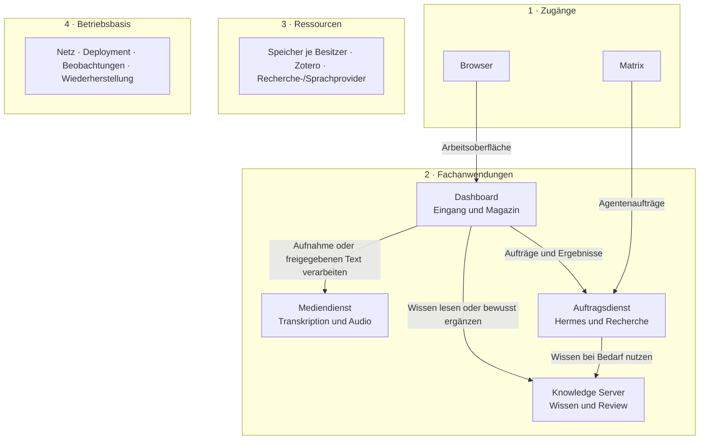

# Schichten und Anwendungen

Festlegung vom 15. September 2026. Diese Fassung ersetzt die flache M01–M14-Liste.
Sie trennt Zugänge, vier Fachanwendungen, Ressourcen und Betriebsbasis. Die
[Namensregeln](system-naming.md) und [Datenflüsse](../contracts/integrations.md)
konkretisieren die Grenzen. Es werden keine neuen Repositories oder Dienste
allein aufgrund dieser Zeichnung angelegt.

## 1 · Zugänge

Der Browser verwendet das Dashboard. Matrix nutzt den bestehenden Hermes-Kanal
für erlaubte Agentenaufträge. Lokale Knowledge-Werkzeuge verwenden weiterhin
seine Fachoperationen. Die Zugänge besitzen keine gemeinsame Browser-Session;
jeder Empfänger prüft Identität und Rechte selbst.

## 2 · Fachanwendungen

| Anwendung | Schlüssel | Interne Module | Eigene Daten |
| --- | --- | --- | --- |
| Dashboard | `dashboard` | access, inbox, magazine, preferences, delivery | Sessions, Captures/Originale, Artikel/Ausgaben, Freigaben und Positionen |
| Auftragsdienst / Task Service | `tasks` | control, research | allgemeine Aufträge, Zeitpläne, Budget und Hermes-Zuordnung |
| Knowledge Server | `knowledge` | records, review, processing, search, sources | kanonisches Wissen, Belege, Bewertungen, Revisionen und Fachverarbeitung |
| Mediendienst / Media Service | `media` | transcriptions, narrations | Medienjobs, abgeleitete Texte und Audioversionen |

**Dashboard:** Magazin ist ein internes Fachmodul mit eigener Datenverantwortung,
keine zusätzliche Publication-API. Der Delivery-Worker vermittelt bestätigte
Absichten und holt Ergebnisse ab; er plant keine Agentenarbeit.

**Auftragsdienst:** Hermes bleibt der Harness. Recherche und News sind begrenzte
Workflows mit Provideradaptern. Der Dienst liefert Resultate, schreibt aber weder
Dashboard-Ausgaben noch Knowledge-Tabellen direkt. Knowledge wird nur bei Bedarf
als autorisiertes Werkzeug aufgerufen.

**Knowledge Server:** Die vorhandenen Import-, Extraktions-, Abgleich- und
Reviewabläufe bleiben erhalten. Freie Gedanken dürfen dauerhaft im Dashboard
bleiben. Seine Referenzpflicht ist kein Hindernis für Capture und wird nicht
durch Dummy-Quellen umgangen.

**Mediendienst:** Transkription und Audioproduktion sind zwei Module mit getrennten
Auftragstypen, Rechten und Limits. Beide dürfen eine Laufzeitumgebung teilen. Originale
bleiben im Dashboard; abgeleitete Ergebnisse werden dort bewusst übernommen.
Ein Medienjob ist kein allgemeiner Hintergrundauftrag.

## 3 · Ressourcen und Adapter

Jede Anwendung besitzt ihren Speicher und ihre Providerzugänge. Ein gemeinsamer
Host oder PostgreSQL-Prozess erlaubt keinen Zugriff auf fremde Tabellen.
Zotero besitzt Literaturmetadaten und Original-PDFs; Knowledge bindet es über
einen Quellenadapter an. Feeds, Websuche und Archive werden durch Task-Workflows
verwendet. Modelle und Sprachruntimes werden vom zuständigen Adapter in Tasks,
Knowledge-Fachverarbeitung oder Media aufgerufen. Bestehende begrenzte
Knowledge-Proposal-Aufrufe bleiben erhalten. Das sind Ressourcen, keine zusätzlichen Fachanwendungen.

## 4 · Betriebsbasis

Private Netzstrecke, TLS, Coolify, Prozessbetrieb, Secrets, Beobachtungen und
Sicherungen unterstützen alle Anwendungen. Sie liegen unter der Facharchitektur
und werden nicht als Stationen in jeden Datenfluss eingebaut. Dashboard zeigt
bereinigte Beobachtungen; der jeweilige Fachbesitzer bleibt Autorität für Jobs.
Kopie und erfolgreicher Restore werden getrennt berichtet.

## Erlaubte Kommunikation

Pfeile zeigen den Aufrufer und den Zweck seines Aufrufs. Ergebnisse kommen auf
derselben Verbindung zurück. Speicher/Betrieb werden separat dokumentiert.

Ein Task-Ergebnis wird vom Dashboard abgerufen und durch `dashboard.magazine`
als Entwurf gespeichert. Eine dort freigegebene Textversion geht an Media.
Knowledge muss keine Magazinbeiträge aktiv verteilen; Media schreibt keine
Capture-Tabelle. Ein Broker oder ein Netz aus Rückrufen ist im ersten Ausbau
nicht erforderlich.

## Bestehender Stand und nächste Schritte

Dashboard besitzt Grundgerüst und CI; Knowledge besitzt lokale Fachfunktionen.
Der Hermes-/Matrix-Kanal existiert, die vollständige Task-API ist noch zu prüfen.
Media und private App-Verbindungen benötigen eine eigene Abnahme. Die
[Codeprüfung](knowledge-server-status.md) bleibt für Knowledge maßgeblich.

Knowledge #36 betrifft nur seinen externen Fachzugriff. Knowledge #40/#41 sind
optionale Wissensexporte; Magazin und Medienverarbeitung hängen nicht davon ab.
Die [Feature-Issues](feature-backlog.md) beginnen mit Dashboard-Speicherung,
Zugang und Erfassung; weitere Fähigkeiten folgen anhand ihrer eigenen Verträge.
